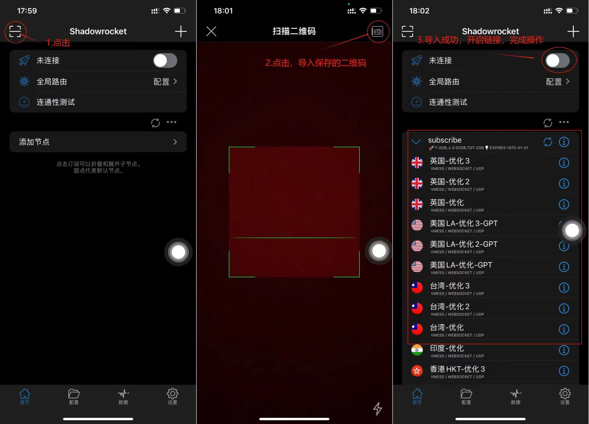

# 苹果手机

::: tip

💗   **建议用浏览器打开本网页**  💗

本文只是软件操作记录分享

已经很详细了，还是不懂，有视频教程 ➡️ [教程](./index)

:::

## 步骤

1. 安装shadowrocket 需要美区appleID

   ::: danger

   免费共享苹果账号必须从**App Store** 登录

   **千万不要登录 iCloud** 

   否则可能导致锁机或者隐私泄漏！按照图片步骤操作！

   :::

   在这个网址获取，点击这里 ➡️ [共享ID](https://idshare001.me/goso.html)

   ::: details 登录操作流程

   

   :::

2. 下载软件

   登录成功后下载软件，点击这里下载 ➡️  [shadowrocket](https://apps.apple.com/us/app/shadowrocket/id932747118?l=zh)

3. 获取自己的 **二维码**、**订阅**

   ::: details 导入操作

   

   :::

4. 导入 **完成**

   

